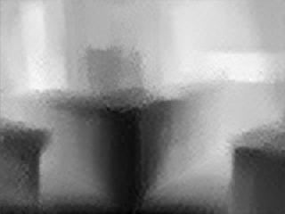

# Depth in The Wild
Pytorch implementation of Single-Image Depth Perception in the Wild https://arxiv.org/pdf/1604.03901.pdf

- [x] Data Loader for NYUDepth
- [x] Architecture
- [x] Custom Criterion
- [x] Train on Small sample
- [x] Tweak Architecture
- [ ] Fully Train Model (310/~500 epochs)
- [ ] Validate Results

## Network Architecture: 

## Targets

## Outputs (120 epochs)

